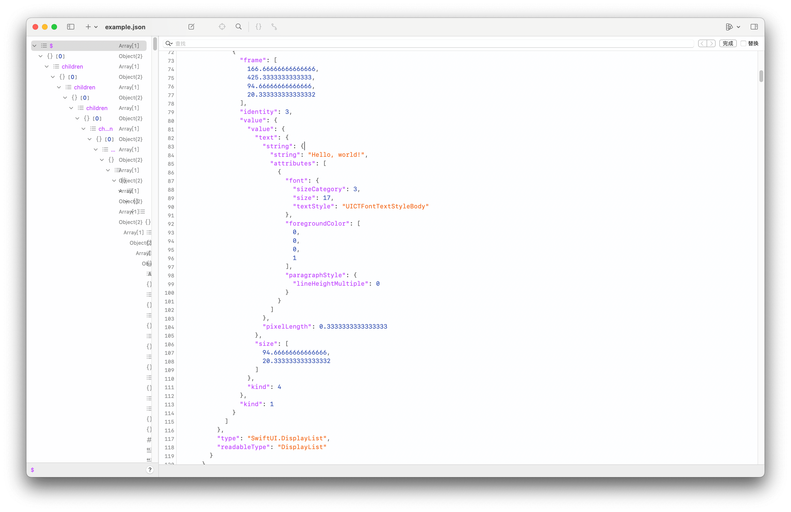

# SwiftUIViewDebug

[](https://swift.org/)

## Background

In addition to `View._printChanges` and `ViewModifier._printChanges` for performance diagnosis, we can also use the method provided by `SwiftUI._ViewDebug` to get *more* debug info of SwiftUI View.

SwiftUI does not full exposed the debug info property for us to use directly. But we can encode it to `Swift.Data`, convert it to `Swift.String` and finally consume it by human readable JSON format.

> Xcode's Debug View Hierarchy Window is probrobly using this method to get more debugging information.
> 
> Other UI debugging Application (such as [Lookin](https://github.com/hughkli/Lookin)) may also use such information to display more information of the SwiftUI view

## Installation

```swift
let package = Package(
    dependencies: [
        .package(url: "https://github.com/Kyle-Ye/SwiftUIViewDebug", from: "1.0.0"),
    ],
    targets: [
        .target(name: <#Target Name#>, dependencies: [
            .product(name: "SwiftUIViewDebug", package: "SwiftUIViewDebug"),
        ]),
    ]
)
```

## Example Usage

```swift
struct ContentView: View {
    var body: some View {
        VStack {
            Image(systemName: "globe")
                .imageScale(.large)
            Text("Hello, world!")
        }
        ._viewDebug { data in
            let string = String(data: data ?? Data(), encoding: .utf8) ?? ""
            print(string)
        }
    }
}
```

See full example usage on Example/ExampleApp

The example output can be found at [example.json](Resources/example.json)



## Explaination

Currently only `_UIHostingView` / `NSHostingView` exposes the `_viewDebugData()` method. So we need to wrap it in `UIHostingController` / `NSHostingController` to get the debug data.

If you are interested in the implementation detail of `_ViewDebug`, you can check my WIP implementation of [_ViewDebug](https://github.com/Kyle-Ye/OpenSwiftUI/blob/1bebc5d5d8a8c1228da9c262b599ac256f9f1467/Sources/OpenSwiftUI/View/Debug/TODO/_ViewDebug.swift) here.

## License

See LICENSE.txt
